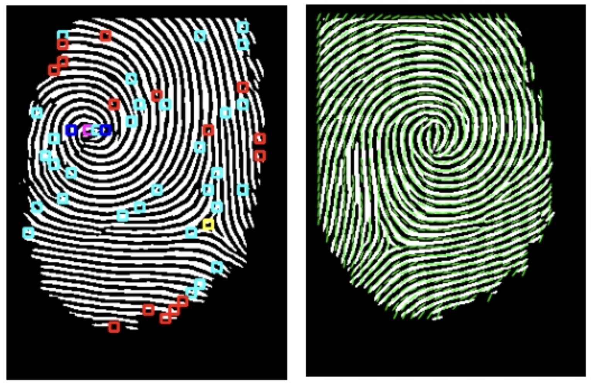
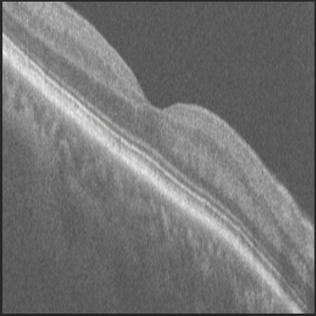
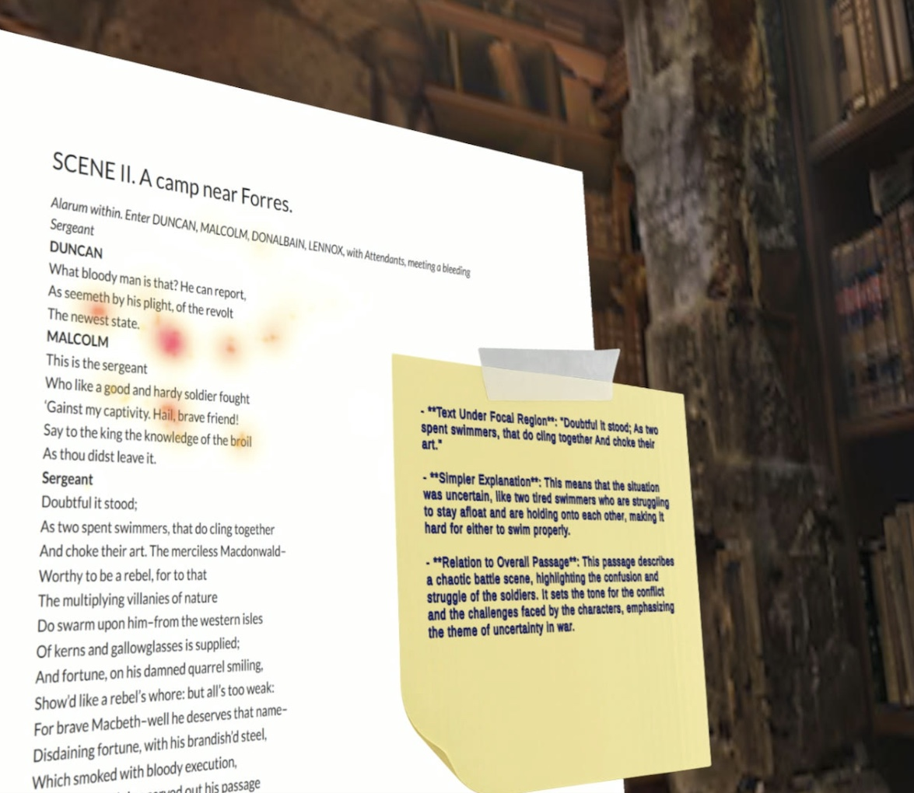

# UChicago-Portfolio

<i>Click on the images for further explanation</i>

<table>
  <tr>
    <td align="center" valign="top">
       
       
      Biometric Authentication
    </td>
    <tr>
    <td align="center" valign="top">
      
       
      OCTDiff: Bridged Diffusion Model for Portable OCT Super-Resolution and Enhancement
    </td>
  </tr>

  <tr>
    <td align="center" valign="top">
     
       
      VR Reading Aid
    </td>
</table>
